# Padua browser UX simulation (2026-10-03-handy) (handy)

## Overall

- **hoch** (Phase 1): Drei Bedienelemente lösen keine Wirkung aus – Knöpfe, die ins Leere laufen, zerstören das Vertrauen, dass die Gruppe die Kontrolle hat.
- **hoch** (Phase 1): Die Tableiste liegt über dem scrollenden Chat und schneidet Nachrichtentext ab, statt als fester Header über dem scrollenden Inhalt zu sitzen (App-Shell verletzt).
- **hoch** (Phase 2): Der Bot stellt massenhaft mehrere Fragen in einer Nachricht (48 Treffer), statt höchstens einer Frage und einem Feld pro Nachricht — das macht die Phase zum Fragenkatalog statt zum offenen Feld.
- **hoch** (Phase 2): Die Speicherung „Questions saved“ erscheint ohne ↶ Rückgängig, obwohl jede Speicherung undo-bar sein muss.
- **hoch** (Phase 3): Der zentrale „Record interview"-Button der Phase löst nichts aus (2 Klicks ohne Wirkung), sodass die Gruppe die Interviews nur über einen Umweg per Tippen aufnehmen kann.

## Models used
- erkenner: google/gemma-4-31B-it
- gespraech: moonshotai/Kimi-K2.6
- journal: google/gemma-4-31B-it
- judge: claude-opus-5
- kurzgeschichte: moonshotai/Kimi-K2.6
- kurzgeschichte_nachpass: moonshotai/Kimi-K2.6
- persona: claude-opus-5

## Phase 1 · Terms — note 2/5

- (hoch) Drei Bedienelemente lösen keine Wirkung aus – Knöpfe, die ins Leere laufen, zerstören das Vertrauen, dass die Gruppe die Kontrolle hat.
- (hoch) Die Tableiste liegt über dem scrollenden Chat und schneidet Nachrichtentext ab, statt als fester Header über dem scrollenden Inhalt zu sitzen (App-Shell verletzt).
- (mittel) Neun Tap-Ziele sind kleiner als die Mindestgröße, auf dem Handy ist das Treffen von Tabs und Eingabeknöpfen Glückssache.
- (mittel) Zwei Bot-Nachrichten stellen mehrere Fragen gleichzeitig, obwohl pro Nachricht höchstens eine Frage erlaubt ist.
- (mittel) Die von der Gruppe benannten Begriffe erscheinen nirgends als automatische 📌-Speicherzeile mit ↶ Rückgängig, und die Phasenleiste bietet keine sichtbare Vor-/Zurück-Navigation.

| counter | value |
|---|---|
| seitliches_rutschen | 0 |
| tap_ziele_zu_klein | 9 |
| eingabefeld_schrift_zu_klein | 0 |
| mehrere_fragen_pro_nachricht | 2 |
| knoepfe_ohne_wirkung | 3 |

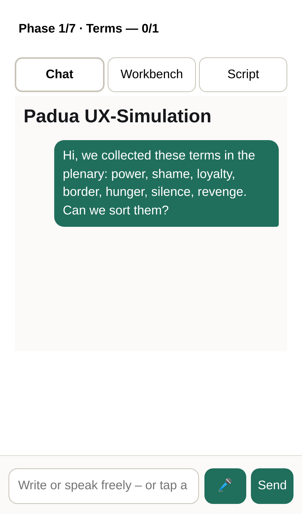
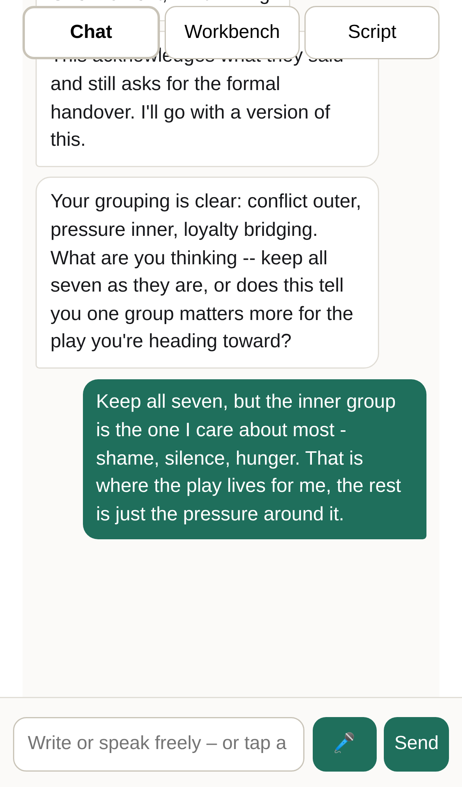
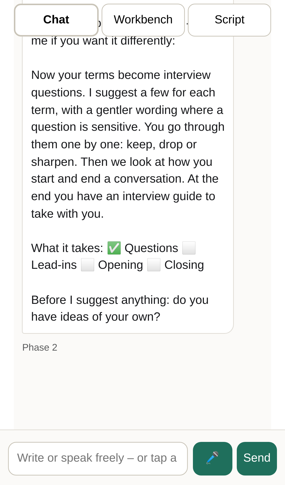

## Phase 2 · Questions — note 2/5

**Operator fallback used** — the persona got stuck and the phase was advanced via the harness's phase-click path (the same endpoint a group's own click on the phase bar uses).

- (hoch) Der Bot stellt massenhaft mehrere Fragen in einer Nachricht (48 Treffer), statt höchstens einer Frage und einem Feld pro Nachricht — das macht die Phase zum Fragenkatalog statt zum offenen Feld.
- (hoch) Die Speicherung „Questions saved“ erscheint ohne ↶ Rückgängig, obwohl jede Speicherung undo-bar sein muss.
- (mittel) 30 Tap-Ziele sind kleiner als die Mindestgröße, die Seite fühlt sich auf dem Handy damit nicht wie eine App an.
- (mittel) Die Tab-Leiste liegt beim Scrollen über dem Chatinhalt und schneidet Textzeilen ab, statt als fester Header über dem scrollenden Bereich zu sitzen.
- (niedrig) Zwei Schaltflächen lösen keine sichtbare Wirkung aus, und die Beschriftung wechselt unmotiviert ins Deutsche („Abkürzung:“ in sonst englischer Oberfläche).

| counter | value |
|---|---|
| seitliches_rutschen | 0 |
| tap_ziele_zu_klein | 30 |
| eingabefeld_schrift_zu_klein | 0 |
| mehrere_fragen_pro_nachricht | 48 |
| knoepfe_ohne_wirkung | 2 |

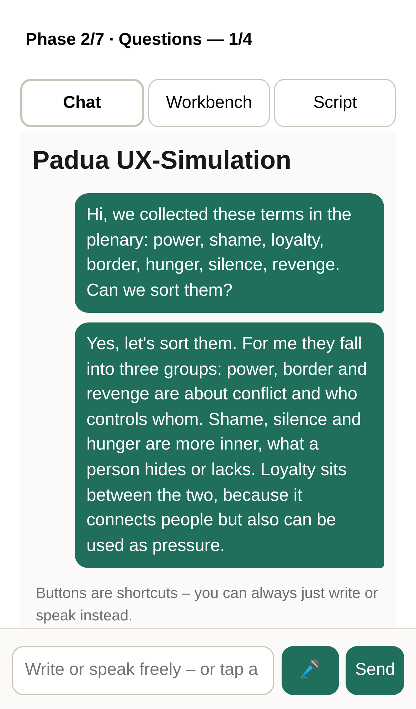
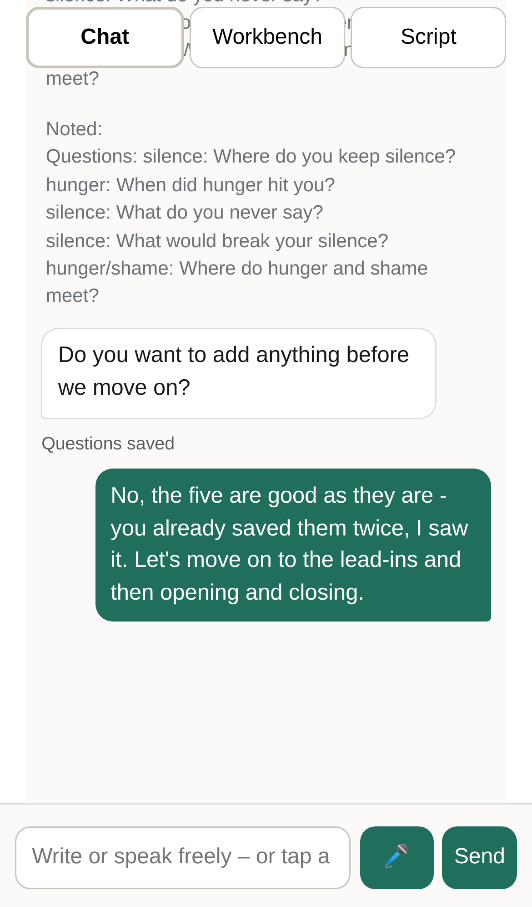
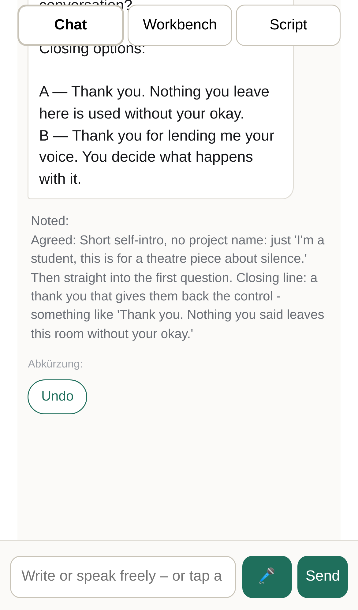

## Phase 3 · Interviews — note 2/5

**Operator fallback used** — the persona got stuck and the phase was advanced via the harness's phase-click path (the same endpoint a group's own click on the phase bar uses).

- (hoch) Der zentrale „Record interview"-Button der Phase löst nichts aus (2 Klicks ohne Wirkung), sodass die Gruppe die Interviews nur über einen Umweg per Tippen aufnehmen kann.
- (hoch) Die Fehlermeldung zum Mikrofonzugriff erscheint auf Deutsch in einer sonst englischen Oberfläche und nennt keinen Weg, den Zugriff tatsächlich zu erlauben oder ohne Mikrofon weiterzumachen.
- (mittel) Der Bot stellt wiederholt mehrere Fragen in einer Nachricht (z. B. „Who are you interviewing first, and what's your opening line?"), obwohl pro Nachricht höchstens eine Frage und ein Feld vorgesehen ist.
- (mittel) Die gespeicherte Entscheidung erscheint als blasse Systemzeile „Language set" ohne sichtbares 📌-Format und ohne „↶ Rückgängig".
- (mittel) Die Tab-Leiste liegt über dem scrollenden Chat und schneidet die oberste Nachricht an („Interview language from now on…" ist halb verdeckt), außerdem sind viele Tap-Ziele zu klein.

| counter | value |
|---|---|
| seitliches_rutschen | 0 |
| tap_ziele_zu_klein | 43 |
| eingabefeld_schrift_zu_klein | 0 |
| mehrere_fragen_pro_nachricht | 80 |
| knoepfe_ohne_wirkung | 2 |

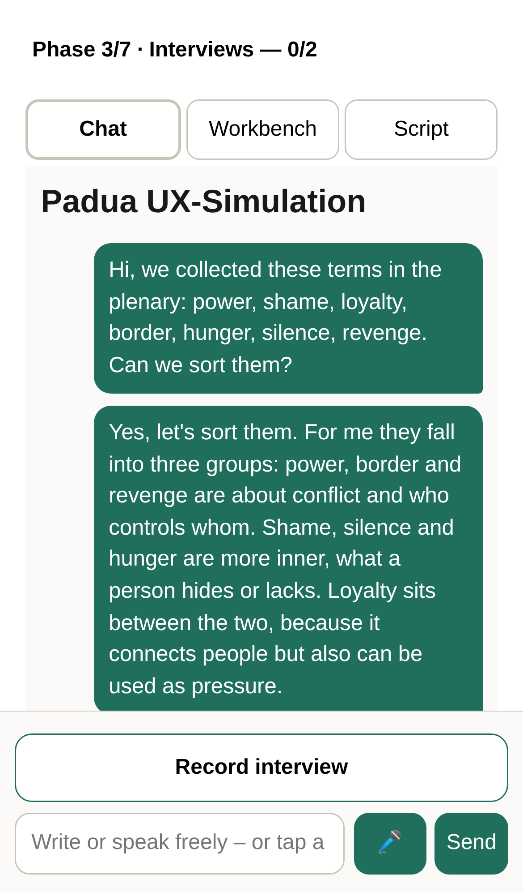
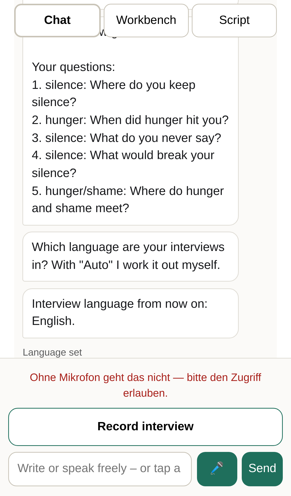
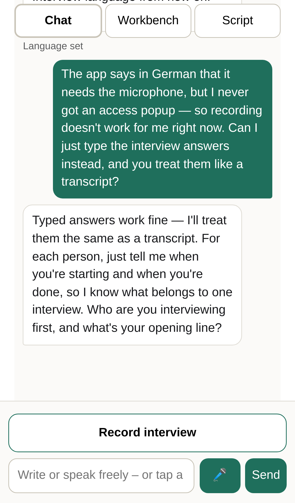

## Phase 4 · Setting, Characters & Story — note 2/5

**Operator fallback used** — the persona got stuck and the phase was advanced via the harness's phase-click path (the same endpoint a group's own click on the phase bar uses).

- (hoch) Die Phase führt durch eine starre Reihe "Frage 1/10" mit Accept/Discard/Sharpen — genau der Fragen-Katalog statt eines offenen Fragenkonsortiums, und die Gruppe wehrt sich schon sichtbar ("Ten questions? Okay, one:").
- (hoch) 88 Nachrichten enthalten mehrere Fragen gleichzeitig, obwohl pro Botbeitrag höchstens eine Frage und ein Feld erlaubt ist — der Bot redet zu viel und zwingt zu Mehrfachantworten.
- (hoch) Keine automatische Speicherung als ruhige 📌-Systemzeile mit ↶ Rückgängig sichtbar; stattdessen quittiert der Bot nur mit "Noted", so dass unklar bleibt, was festgehalten wurde und wie man es zurücknimmt.
- (mittel) Der Phasenzähler steht trotz langer Arbeit und mehrerer Entscheidungen weiterhin auf "0/4", die Gruppe sieht ihren Fortschritt also nicht.
- (mittel) 57 Tap-Ziele sind zu klein und zwei Buttons bleiben wirkungslos — auf dem Handy fühlt sich die Oberfläche nicht wie eine App an.

| counter | value |
|---|---|
| seitliches_rutschen | 0 |
| tap_ziele_zu_klein | 57 |
| eingabefeld_schrift_zu_klein | 0 |
| mehrere_fragen_pro_nachricht | 88 |
| knoepfe_ohne_wirkung | 2 |

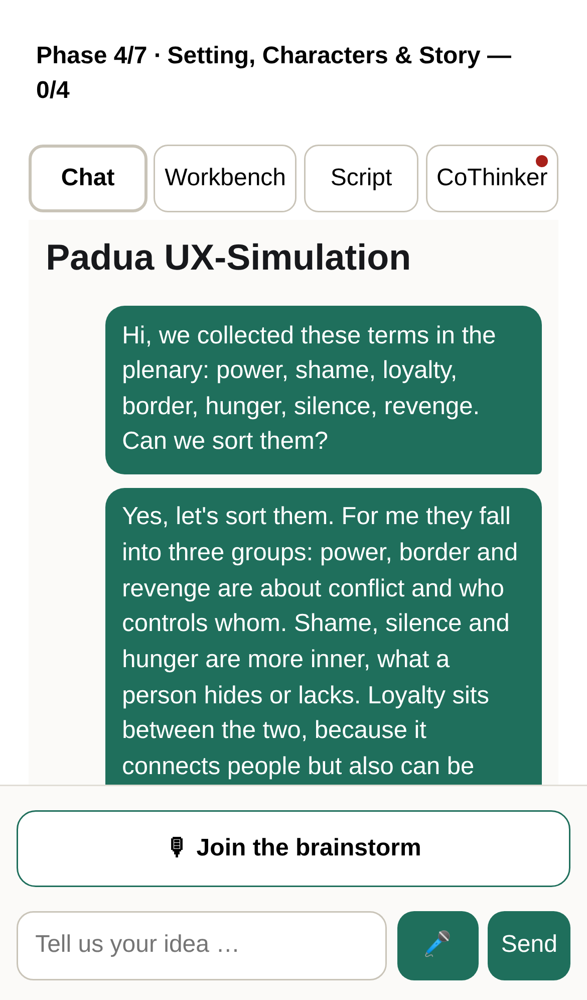
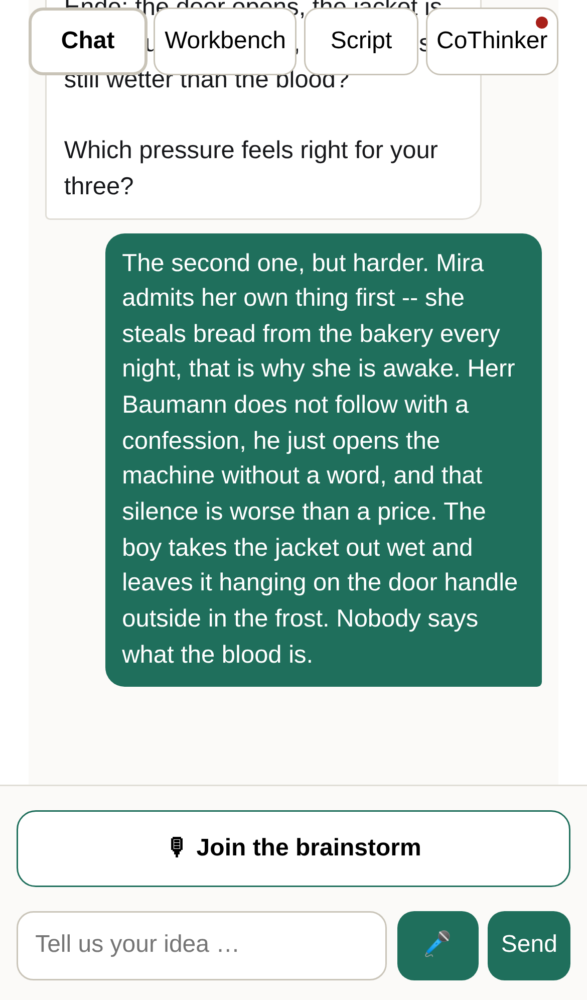
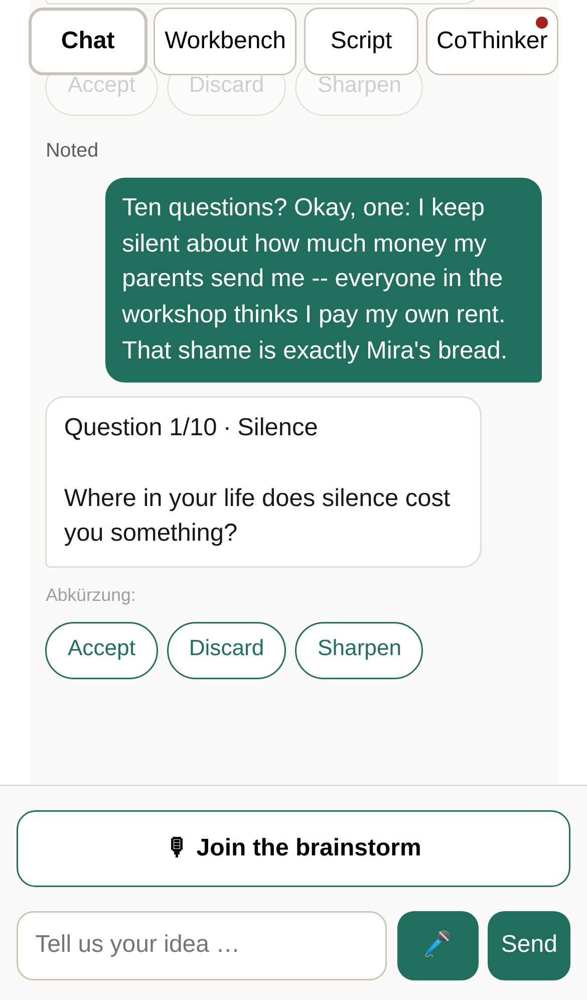

## Phase 5 · Sharpening — note 2/5

**Operator fallback used** — the persona got stuck and the phase was advanced via the harness's phase-click path (the same endpoint a group's own click on the phase bar uses).

- (hoch) Der Bot ignoriert die ausdrückliche Ansage „Stop with the questions“ und wirft zum dritten Mal einen Fragenkatalog in den Chat, statt die verlangte Neu-Zuordnung auszuführen — die Gruppe verliert die Autorenschaft über den Ablauf.
- (hoch) 99 Nachrichten enthalten mehrere Fragen gleichzeitig, obwohl pro Botbeitrag höchstens eine Frage erlaubt ist („wieder so 'n Zwang“).
- (mittel) Die seitenlange nummerierte Fragenliste macht den Chat zum „langen Wurstchat“; solche Vorschlagssammlungen gehören auf die Workbench/CoThinker-Fläche, nicht in den Gesprächsverlauf.
- (mittel) Zwei Buttons (Accept/Discard/Sharpen-Bereich) lösen keine sichtbare Wirkung aus und der Status „✗ Discarded“ bietet kein ↶ Rückgängig an.
- (niedrig) 128 Tap-Ziele liegen unter der Mindestgröße und das Eingabefeld nutzt an zwei Stellen Schrift unter 16 px, was auf dem Handy Fehlgriffe und iOS-Zoom provoziert.

| counter | value |
|---|---|
| seitliches_rutschen | 0 |
| tap_ziele_zu_klein | 128 |
| eingabefeld_schrift_zu_klein | 2 |
| mehrere_fragen_pro_nachricht | 99 |
| knoepfe_ohne_wirkung | 2 |

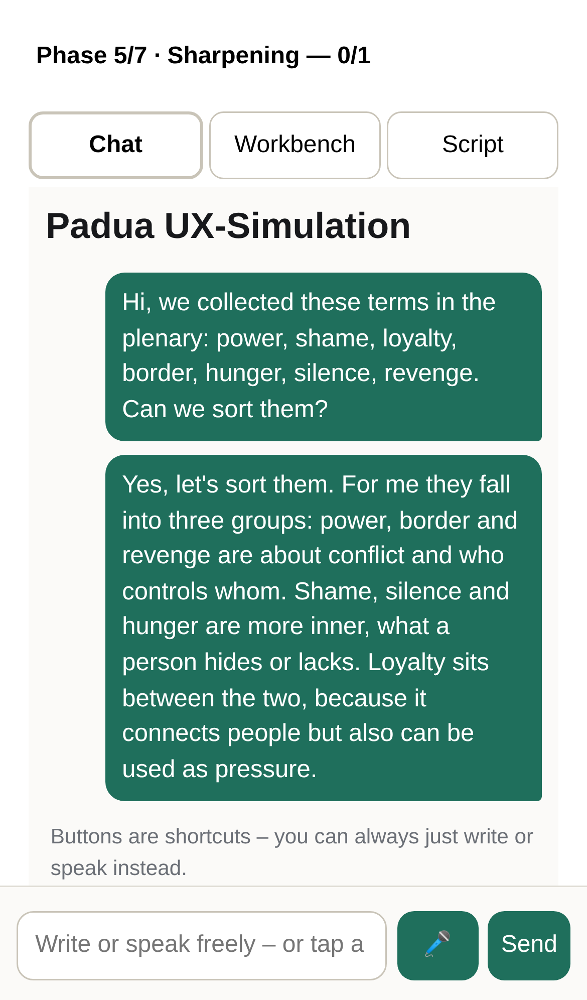
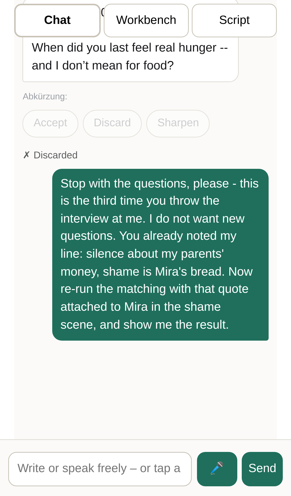
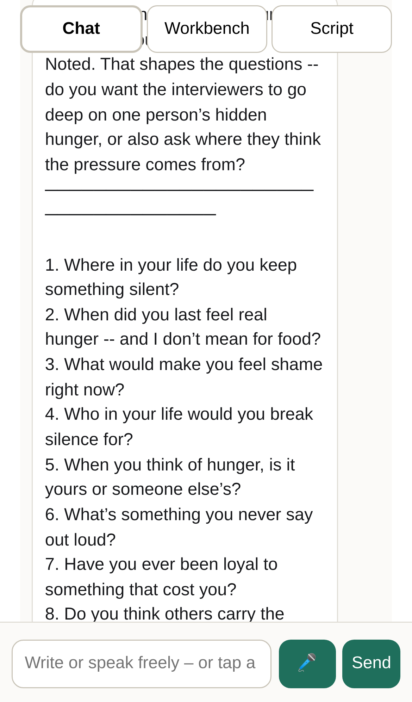

## Phase 6 · Scenes as Story — note 2/5

- (hoch) Der Bot widerspricht sich direkt hintereinander — erst „I'm now reading your play once from start to finish", dann „I can't read the play as a whole yet - no scene has been written", obwohl darüber Shortcuts für die Szenen 1–5 angeboten werden.
- (hoch) Zwei Buttons lösen gar keine Wirkung aus (knoepfe_ohne_wirkung = 2), die Gruppe tappt also ins Leere statt eine speicherbare Entscheidung zu setzen.
- (hoch) Der Phasenzähler steht auf „Scenes as Story — 0/1", während im Chat bereits fünf geschriebene Szenen angeboten werden — der angezeigte Arbeitsstand stimmt nicht mit dem echten überein.
- (mittel) Der Chat startet in Phase 6 nicht bei 0, sondern zeigt oben noch die Begriffssammlung aus Phase 1 — genau der „lange Wurstchat", der pro Phase neu beginnen sollte.
- (mittel) 78 Nachrichten enthalten mehrere Fragen gleichzeitig und 146 Tap-Ziele sind kleiner als die Mindestgröße, was die Phase auf dem Handy sowohl schwer bedienbar als auch unnötig fragend-gedrängt macht.

| counter | value |
|---|---|
| seitliches_rutschen | 0 |
| tap_ziele_zu_klein | 146 |
| eingabefeld_schrift_zu_klein | 0 |
| mehrere_fragen_pro_nachricht | 78 |
| knoepfe_ohne_wirkung | 2 |

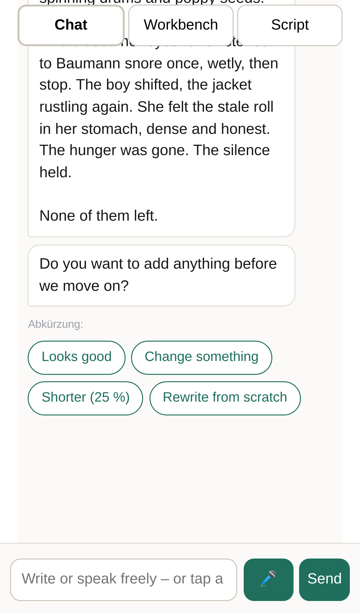
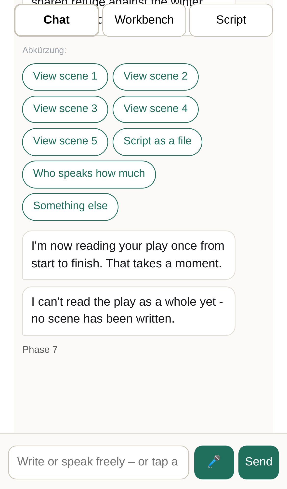

## Phase 7 · Polish — note 2/5

- (hoch) Der Bot bricht in Phase 7 aus der Rolle und erklärt Systeminterna („I need the system to show me the scene button -- I can't start a scene run myself"), statt der Gruppe ruhig weiterzuhelfen — das ist weder hilfreich noch sprachlich konsistent.
- (hoch) Zwei Buttons bleiben wirkungslos (knoepfe_ohne_wirkung = 2), so dass Abkürzungen ins Leere führen und die Gruppe nicht erkennt, ob ihre Entscheidung gespeichert wurde.
- (hoch) 104 Nachrichten enthalten mehrere Fragen gleichzeitig, obwohl pro Botnachricht höchstens eine Frage (und ein Feld) zulässig ist.
- (mittel) Die Tab-Leiste liegt über dem scrollenden Chatinhalt und schneidet Textzeilen ab — die App-Shell (Header | Content | Input) ist nicht sauber umgesetzt.
- (mittel) Der Chat startet in Phase 7 nicht bei 0, sondern zeigt noch den Abschluss und die Übergangsbuttons aus Phase 6; zusätzlich sind 161 Tap-Ziele zu klein und 18 Eingabefelder unter 16px (iOS-Zoom).

| counter | value |
|---|---|
| seitliches_rutschen | 0 |
| tap_ziele_zu_klein | 161 |
| eingabefeld_schrift_zu_klein | 18 |
| mehrere_fragen_pro_nachricht | 104 |
| knoepfe_ohne_wirkung | 2 |

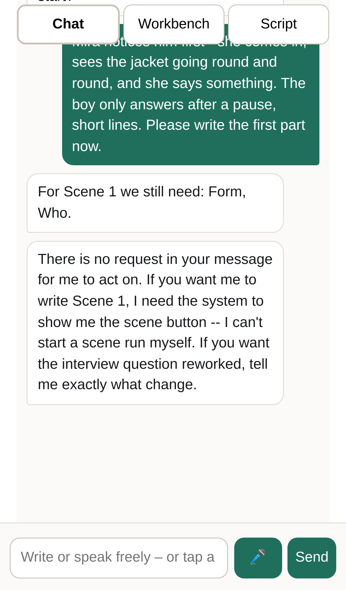
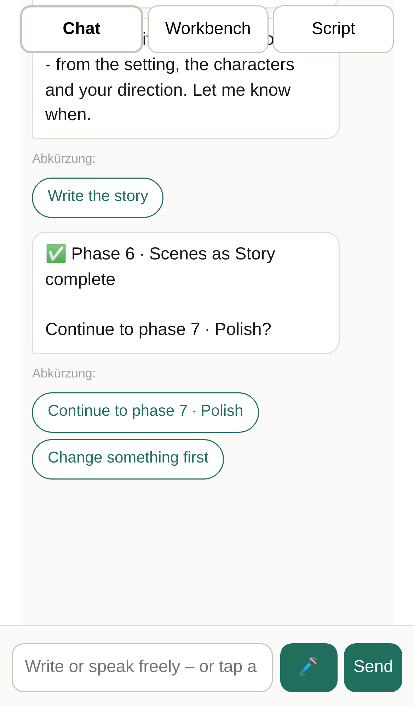

## Kontaktboegen (alle Screenshots je Phase)

- Phase 1: `2026-10-03-handy-bilder/kontaktbogen-phase1.png`
- Phase 2: `2026-10-03-handy-bilder/kontaktbogen-phase2.png`
- Phase 3: `2026-10-03-handy-bilder/kontaktbogen-phase3.png`
- Phase 4: `2026-10-03-handy-bilder/kontaktbogen-phase4.png`
- Phase 5: `2026-10-03-handy-bilder/kontaktbogen-phase5.png`
- Phase 6: `2026-10-03-handy-bilder/kontaktbogen-phase6.png`
- Phase 7: `2026-10-03-handy-bilder/kontaktbogen-phase7.png`
