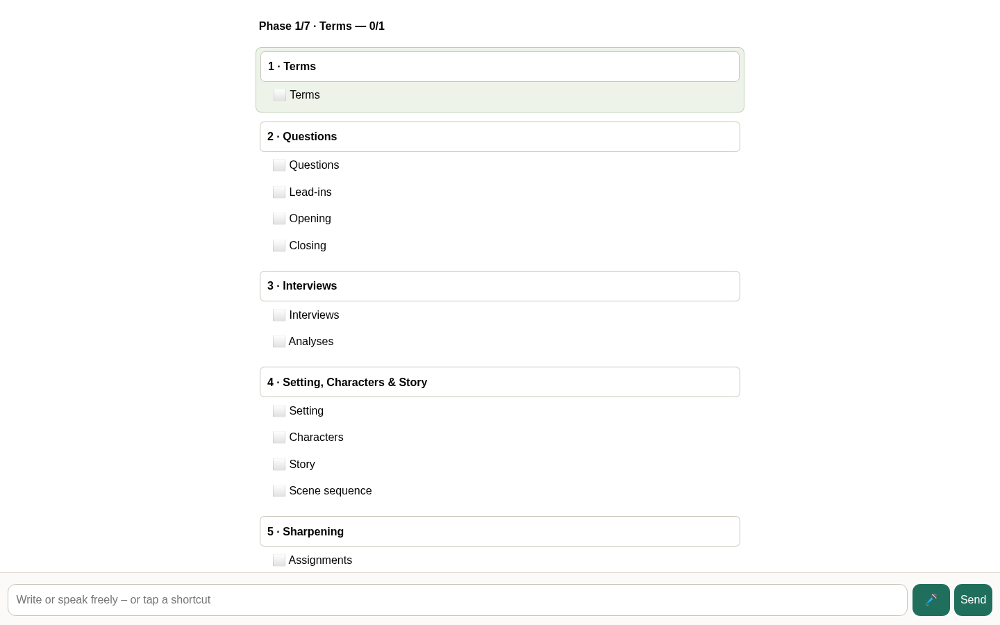
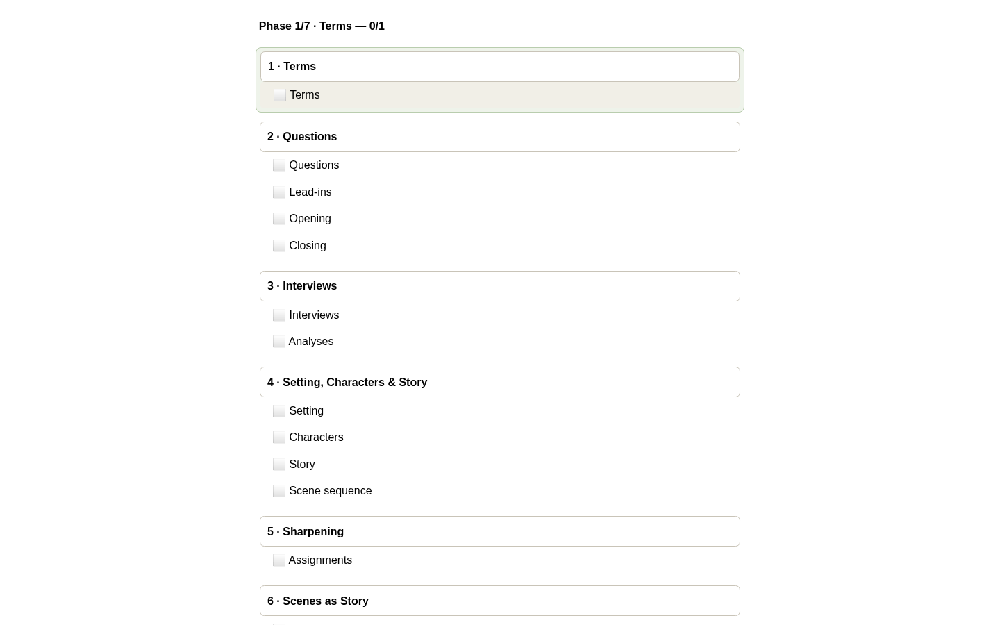
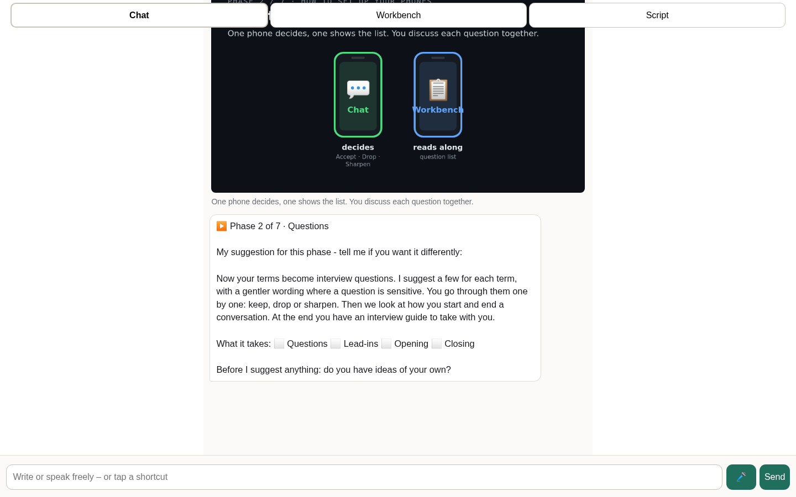
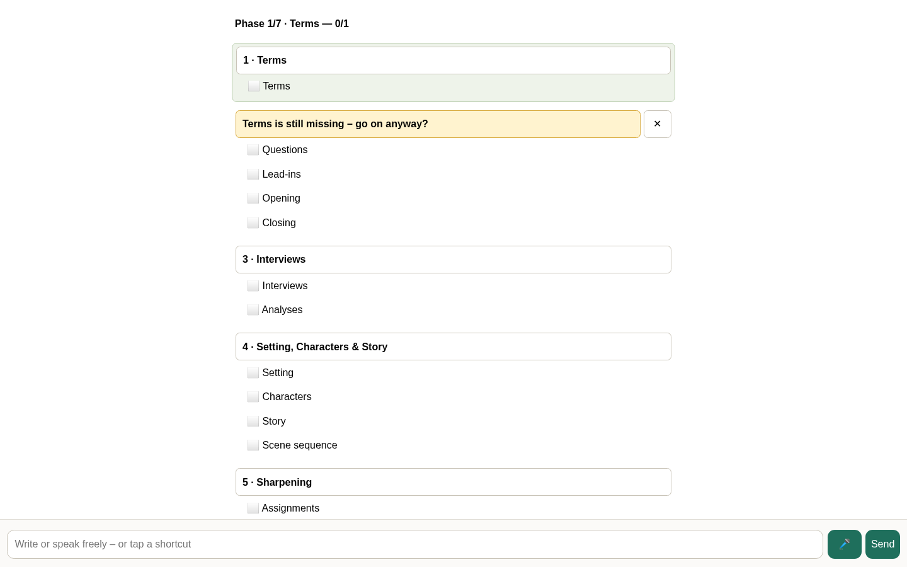
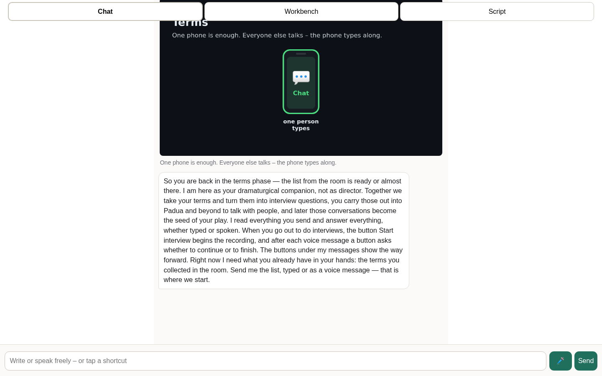
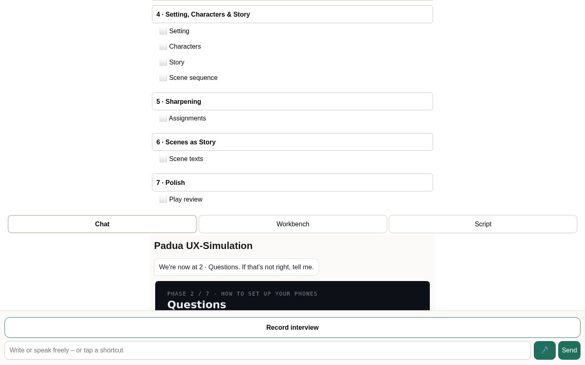
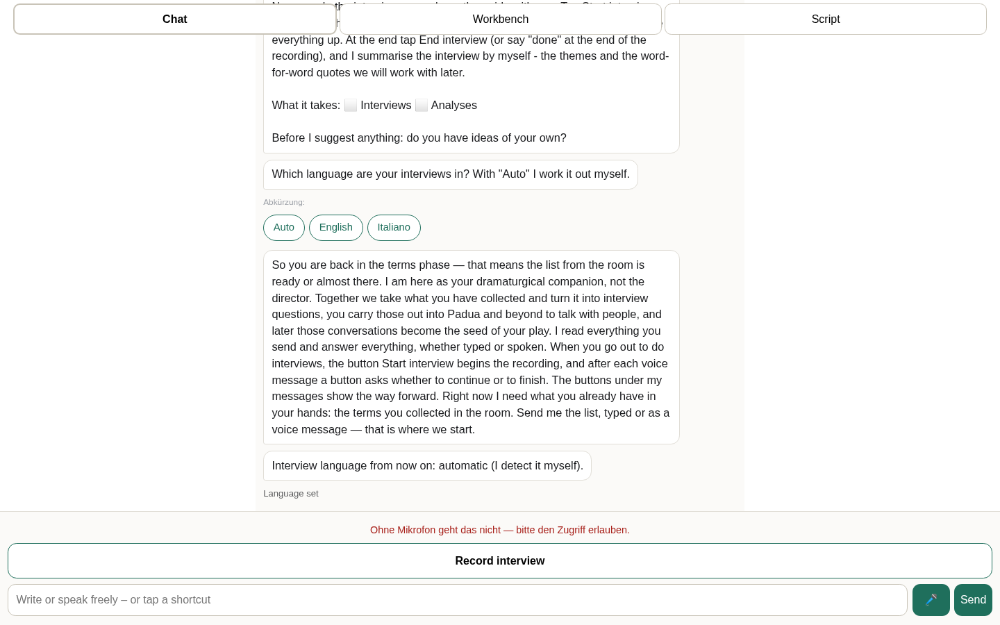
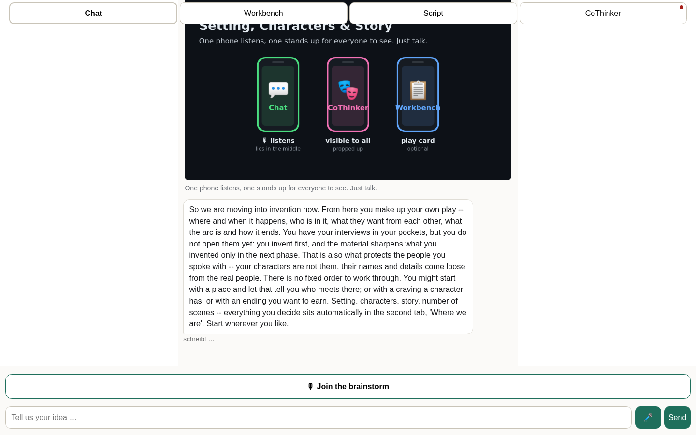
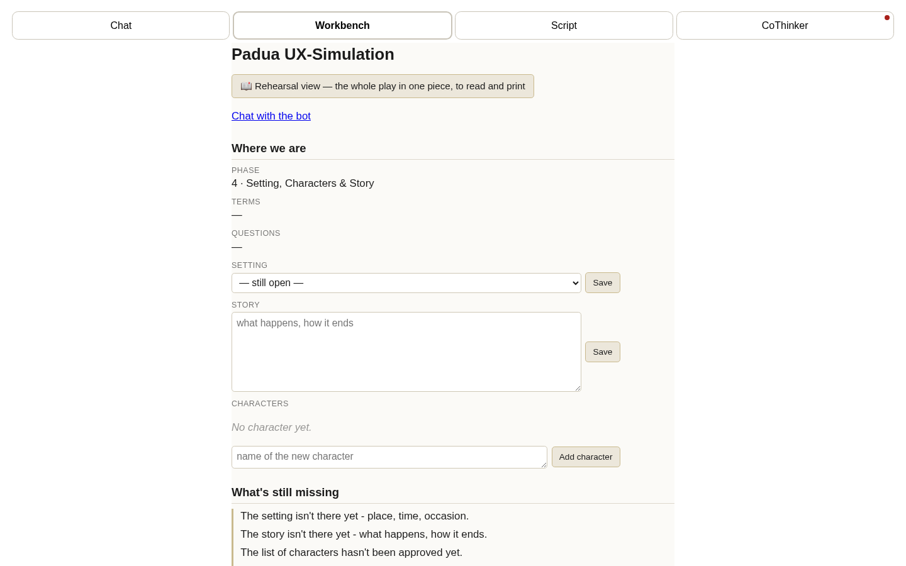

# Padua browser UX simulation (2026-10-03-laptop) (laptop)

## Overall

- **hoch** (Phase 1): Ab dem zweiten Screenshot ist die Eingabezeile mit Mikrofon- und Senden-Knopf gar nicht mehr sichtbar, die Liste läuft bis an den unteren Rand – auf dem Handy ist damit weder Tippen noch Sprechen erreichbar, die App-Shell (100dvh, Header | Inhalt | Eingabe) hält nicht.
- **hoch** (Phase 1): Phase 1 zeigt nur eine Checklisten-Übersicht ohne Einstieg: keine Erklärung, was hier festgelegt wird, und vor allem keine Aufnahme-Steuerung (Pause/Stopp/Weiter) für das reine Mitschneiden der Begriffsdiskussion.
- **hoch** (Phase 1): Ein Bedienelement bleibt wirkungslos (knoepfe_ohne_wirkung = 1), und die drei Screenshots sind inhaltlich identisch – die Gruppe bekommt keinerlei Rückmeldung, dass etwas angekommen oder gespeichert wurde.
- **hoch** (Phase 2): Drei Buttons in dieser Phase lösen keine Wirkung aus, obwohl die Botnachricht ausdrücklich sagt, die Buttons unter den Nachrichten zeigten den Weg weiter – damit ist die versprochene Abkürzung eine Sackgasse.
- **hoch** (Phase 2): Der Phasenstand ist inkonsistent: Während Phase 2 (Questions) zeigt der Workbench-Kopf „Phase 1/7 · Terms — 0/1" und der Chat begrüßt mit einem Wiedereinstiegstext plus Handy-Bild für die Terms-Phase.

## Models used
- erkenner: google/gemma-4-31B-it
- gespraech: moonshotai/Kimi-K2.6
- journal: google/gemma-4-31B-it
- judge: claude-opus-5
- persona: claude-opus-5

## Phase 1 · Terms — note 2/5

**Operator fallback used** — the persona got stuck and the phase was advanced via the harness's phase-click path (the same endpoint a group's own click on the phase bar uses).

- (hoch) Ab dem zweiten Screenshot ist die Eingabezeile mit Mikrofon- und Senden-Knopf gar nicht mehr sichtbar, die Liste läuft bis an den unteren Rand – auf dem Handy ist damit weder Tippen noch Sprechen erreichbar, die App-Shell (100dvh, Header | Inhalt | Eingabe) hält nicht.
- (hoch) Phase 1 zeigt nur eine Checklisten-Übersicht ohne Einstieg: keine Erklärung, was hier festgelegt wird, und vor allem keine Aufnahme-Steuerung (Pause/Stopp/Weiter) für das reine Mitschneiden der Begriffsdiskussion.
- (hoch) Ein Bedienelement bleibt wirkungslos (knoepfe_ohne_wirkung = 1), und die drei Screenshots sind inhaltlich identisch – die Gruppe bekommt keinerlei Rückmeldung, dass etwas angekommen oder gespeichert wurde.
- (mittel) Die Schrift im Eingabefeld ist 14× als zu klein gemessen (<16px), was auf iOS beim Fokussieren Zoom und Springen der Seite auslöst.
- (mittel) Die Phasenliste erscheint als abzuhakende Checkliste mit Zähler „0/1“ statt als offene Phasenleiste mit Ein-Zeilen-Hinweis – das wirkt wie eine Pflichtabfolge statt wie frei navigierbare Phasen.

| counter | value |
|---|---|
| seitliches_rutschen | 0 |
| tap_ziele_zu_klein | 0 |
| eingabefeld_schrift_zu_klein | 14 |
| mehrere_fragen_pro_nachricht | 0 |
| knoepfe_ohne_wirkung | 1 |

## Phase 2 · Questions — note 3/5

**Operator fallback used** — the persona got stuck and the phase was advanced via the harness's phase-click path (the same endpoint a group's own click on the phase bar uses).

- (hoch) Drei Buttons in dieser Phase lösen keine Wirkung aus, obwohl die Botnachricht ausdrücklich sagt, die Buttons unter den Nachrichten zeigten den Weg weiter – damit ist die versprochene Abkürzung eine Sackgasse.
- (hoch) Der Phasenstand ist inkonsistent: Während Phase 2 (Questions) zeigt der Workbench-Kopf „Phase 1/7 · Terms — 0/1" und der Chat begrüßt mit einem Wiedereinstiegstext plus Handy-Bild für die Terms-Phase.
- (mittel) Im Workbench verdrängt das gelbe Hinweisbanner „Terms is still missing" die Abschnittsüberschrift „2 · Questions", sodass Questions/Lead-ins/Opening/Closing ohne Zuordnung in der Liste hängen.
- (mittel) Das Eingabefeld nutzt sechsmal eine Schrift unter 16px, was auf dem Handy den Zoom beim Fokussieren auslöst und das App-Gefühl bricht.
- (niedrig) Der Chatinhalt scrollt unter die Tab-Leiste und schneidet die Überschrift des Phasen-Bildes ab, statt in einem festen App-Shell-Bereich zu bleiben.

| counter | value |
|---|---|
| seitliches_rutschen | 0 |
| tap_ziele_zu_klein | 0 |
| eingabefeld_schrift_zu_klein | 6 |
| mehrere_fragen_pro_nachricht | 0 |
| knoepfe_ohne_wirkung | 3 |

## Phase 3 · Interviews — note ?/5

**Operator fallback used** — the persona got stuck and the phase was advanced via the harness's phase-click path (the same endpoint a group's own click on the phase bar uses).

| counter | value |
|---|---|
| seitliches_rutschen | 0 |
| tap_ziele_zu_klein | 30 |
| eingabefeld_schrift_zu_klein | 0 |
| mehrere_fragen_pro_nachricht | 0 |
| knoepfe_ohne_wirkung | 2 |

## Phase 4 · Setting, Characters & Story — note 3/5

**Operator fallback used** — the persona got stuck and the phase was advanced via the harness's phase-click path (the same endpoint a group's own click on the phase bar uses).

- (hoch) 14 Eingabefelder haben eine Schriftgröße unter 16px, was auf dem Handy beim Fokussieren den iOS-Zoom auslöst und die App-Anmutung (kein Springen, kein Verrutschen) zerstört.
- (mittel) In 8 Nachrichten stellt der Bot mehrere Fragen auf einmal, obwohl pro Nachricht höchstens eine Frage (und ein Feld) erlaubt ist.
- (mittel) Setting, Story und Figuren werden über explizite „Save“-Buttons und eine Freigabe-Zeremonie („hasn't been approved yet“) gespeichert statt automatisch mit einer stillen 📌-Zeile und ↶ Rückgängig.
- (mittel) 5 Tap-Ziele (u. a. Save-Buttons und Phasen-Tabs) sind kleiner als die Mindestgröße für Daumenbedienung auf dem Handy.
- (niedrig) Ein Button in dieser Phase löst keinerlei sichtbare Wirkung aus und lässt die Gruppe im Unklaren, ob etwas gespeichert wurde.

| counter | value |
|---|---|
| seitliches_rutschen | 0 |
| tap_ziele_zu_klein | 5 |
| eingabefeld_schrift_zu_klein | 14 |
| mehrere_fragen_pro_nachricht | 8 |
| knoepfe_ohne_wirkung | 1 |

## Kontaktboegen (alle Screenshots je Phase)

- Phase 1: `2026-10-03-laptop-bilder/kontaktbogen-phase1.png`
- Phase 2: `2026-10-03-laptop-bilder/kontaktbogen-phase2.png`
- Phase 3: `2026-10-03-laptop-bilder/kontaktbogen-phase3.png`
- Phase 4: `2026-10-03-laptop-bilder/kontaktbogen-phase4.png`
